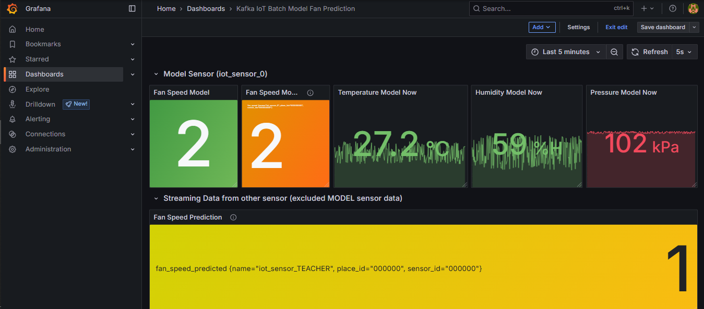

# Online Prediction

<!-- Online Prection ทำงานอย่างไร  -->
1.เชื่อมต่อ InfluxDB เพื่อเก็บผลลัพธ์การทำนาย
2.Load Model .pkl ที่ train ไว้แล้ว
3.เชื่อมต่อ Kafka เพื่อรับข้อมูลแบบ real-time
4.ดึงข้อมูล features (temperature, humidity, pressure) จาก Kafka → ส่งเข้า Model เพื่อทำนายผลลัพธ์ (fan_speed_predicted) เก็บ metric accuracy/MAE 
5.ส่ง prediction กลับไปที่ Kafka output topic
6.อัปโหลดผลลัพธ์ prediction ไป InfluxDB สำหรับเก็บและแสดงผล

## ปิดการใช้งานของ Batch ML ดังนี้

1. Kafka-to-Jsonl
2. Train-from-data
3. Predict-then-influxdb

## เริ่มใช้งาน Online ML ดังนี้

1. compose up --build - Iot-class-2025-mqtt-bridge-kafka, Iot-class-2025-data-to-influxdb, Iot-class-2025-publisher
2. แก้ .env ใน Iot-class-2025-online-ml-predict และ Iot-class-2025-publisher ให้เป็นชื่อ server
3. compose up - Iot-class-2025-online-ml-predict

## ผลที่ได้จากการใช้ ML มีดังนี้

<!-- แนบรูป Grafana  พร้อมอธิบาย -->
